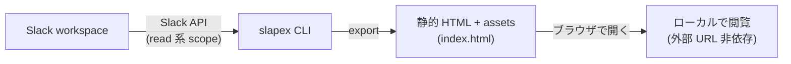

<p align="center">
  
</p>

# slapex

`slapex` は、Slack channel の投稿・スレッド・画像・添付ファイルを、外部 URL に依存せずローカルで閲覧できる静的 HTML + assets 一式として export(書き出し)する CLI です。

主な特徴:

- **単一バイナリ** — ランタイム不要。GitHub Releases から OS / arch に合うバイナリを 1 つ取得するだけで動作します。
- **JavaScript なしの静的 HTML** — 生成物は素の HTML + CSS + assets。ブラウザで `index.html` を開くだけで閲覧でき、外部 URL に依存しません。
- **read 系 scope のみ** — Slack へは履歴・ファイル・絵文字・ユーザー情報の取得など read 系 scope だけを使います。
- **スレッド・絵文字・reaction・unfurl 対応** — thread の返信、標準 / カスタム絵文字、reaction、URL unfurl の preview 画像なども取得して描画します。

対象プラットフォームは macOS と Linux(それぞれ amd64 / arm64)です。Windows は初期対象外です。

## 出力プレビュー

全体の流れ:



ターミナルでの実行イメージ(token の対話入力 → channel の選択 → 進捗表示 → 完了):

<p align="center"></p>

タイムライン表示(日付区切り、システムメッセージ、mrkdwn 装飾、メンション、絵文字、reaction、画像、URL unfurl):

<p align="center"></p>

スレッド、コードブロック、bot 投稿、添付ファイル:

<p align="center"></p>

デモとスクリーンショットはいずれも同梱の生成済みサンプル export と同じ架空データのものです(実 workspace・実 token は使っていません)。リポジトリを clone して [`doc/samples/ja/index.html`](doc/samples/ja/index.html) をブラウザで開くと、この出力をそのまま閲覧できます(英語版サンプルは [`doc/samples/en/index.html`](doc/samples/en/index.html))。

インストール済みなら、Slack App や token を用意する前に `--demo` を実行するだけで、この架空サンプルから手元で HTML export を生成して試せます(token 不要):

```sh
slapex --demo --output ./slapex-demo
```

## クイックスタート

初めて使う場合は、チェックリスト形式の [クイックスタート](doc/help/quickstart.md) に沿って進めると、インストールから初回 export・閲覧までを 1 ページで完走できます(所要 15 分程度)。

インストールだけ先に済ませる場合(macOS の例):

```sh
brew install --cask kiyohara/tap/slapex
```

Linux や install script、手動インストール(checksum 検証)などその他の方法は [インストール](doc/help/installation.md) を参照してください。

## 利用方法の詳細

用途別の詳細は次の help を参照してください。

- **Slack のセットアップ**: [Slack App 準備手順](doc/help/slack-app-setup.md) — App の作成、scope 設定、install、token 発行。
- **Token の渡し方**: [Token の渡し方](doc/help/token-injection.md) — 1Password CLI、CI secrets、対話入力。
- **インストール**: [インストール](doc/help/installation.md) — Homebrew Cask、install script、手動手順と checksum 検証。
- **使い方**: [使い方](doc/help/usage.md) — 実行方法、option 一覧、cache、出力の構造。
- **制限事項・FAQ**: [よくある質問・制限事項](doc/help/faq.md) — 取得範囲の default、再現されない表示、つまずいたときの対処。

## 開発者向けドキュメント

- ドキュメント配置の入口: [`doc/README.md`](doc/README.md)
- AI agent / 開発者向け共通入口とガイドライン: [`AGENTS.md`](AGENTS.md)

## ライセンス

MIT License。詳細は [`LICENSE`](LICENSE) を参照してください。
