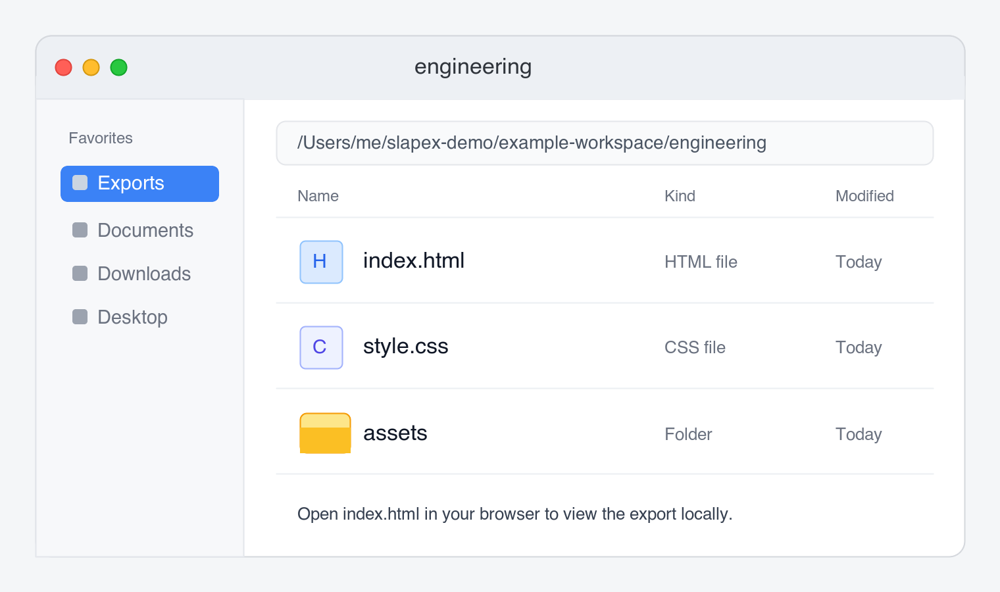

<p align="center">
  
</p>

# slapex

`slapex` は、Slack channel の投稿・スレッド・画像・添付ファイルを、thread の返信、標準 / カスタム絵文字、reaction、URL unfurl の preview 画像ごと、ローカルで閲覧できる静的 HTML + assets 一式として export(書き出し)する CLI です。

対象プラットフォームは macOS と Linux(それぞれ amd64 / arm64)です。Windows は初期対象外です。

## ターミナルでの実行例

token の対話入力、channel の選択、進捗表示、完了までの流れ:

<p align="center"></p>

Slack App や token を用意する前に試す場合は、`--demo` で同梱サンプルから HTML export を生成できます。

```sh
slapex --demo --output ./slapex-demo
```

完了時には出力先ディレクトリの絶対 path が表示されます。Finder で開くと、`index.html`、`style.css`、`assets/` がローカルファイルとして並びます。

<p align="center"></p>

## 出力プレビュー

タイムライン表示(日付区切り、システムメッセージ、mrkdwn 装飾、メンション、絵文字、reaction、画像、URL unfurl):

<p align="center"></p>

スレッド、コードブロック、bot 投稿、添付ファイル:

<p align="center"></p>

リポジトリを clone して [`doc/samples/ja/index.html`](doc/samples/ja/index.html) をブラウザで開くと、この出力をそのまま閲覧できます(英語版サンプルは [`doc/samples/en/index.html`](doc/samples/en/index.html))。[^sample-data]

## クイックスタート

初めて使う場合は、チェックリスト形式の [クイックスタート](doc/help/quickstart.md) に沿って進めると、インストールから初回 export・閲覧までを 1 ページで完走できます(所要 15 分程度)。

インストールだけ先に済ませる場合(macOS の例):

```sh
brew install --cask kiyohara/tap/slapex
```

Linux や install script、手動インストール(checksum 検証)などその他の方法は [インストール](doc/help/installation.md) を参照してください。

## 利用方法の詳細

用途別の詳細は次の help を参照してください。

- **Slack のセットアップ**: [Slack App 準備手順](doc/help/slack-app-setup.md) — App の作成、scope 設定、install、token 発行。
- **Token の渡し方**: [Token の渡し方](doc/help/token-injection.md) — 実行時の貼り付け(基本)、secret manager、CI secrets。
- **インストール**: [インストール](doc/help/installation.md) — Homebrew Cask、install script、手動手順と checksum 検証。
- **使い方**: [使い方](doc/help/usage.md) — 実行方法、option 一覧、cache、出力の構造。
- **制限事項・FAQ**: [よくある質問・制限事項](doc/help/faq.md) — 取得範囲の default、再現されない表示、つまずいたときの対処。

## 開発者向けドキュメント

- ドキュメント配置の入口: [`doc/README.md`](doc/README.md)
- AI agent / 開発者向け共通入口とガイドライン: [`AGENTS.md`](AGENTS.md)

## ライセンス

MIT License。詳細は [`LICENSE`](LICENSE) を参照してください。

[^sample-data]: `--demo` とスクリーンショットは、同梱の生成済みサンプル export と同じ架空データを使います。
