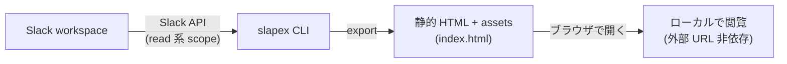

<p align="center">
  
</p>

# slapex

`slapex` は、Slack channel の投稿・スレッド・画像・添付ファイルを、外部 URL に依存せずローカルで閲覧できる静的 HTML + assets 一式として export(書き出し)する CLI です。

## 概要

`SLACK_TOKEN`(Slack OAuth token)で対象 workspace を解決し、指定した channel の履歴を取得して、ローカルブラウザで開ける `index.html` と assets をまとめて出力します。

主な特徴:

- **単一バイナリ** — ランタイム不要。GitHub Releases から OS / arch に合うバイナリを 1 つ取得するだけで動作します。
- **JavaScript なしの静的 HTML** — 生成物は素の HTML + CSS + assets。ブラウザで `index.html` を開くだけで閲覧でき、外部 URL に依存しません。
- **read 系 scope のみ** — Slack へは履歴・ファイル・絵文字・ユーザー情報の取得など read 系 scope だけを使います。
- **スレッド・絵文字・reaction・unfurl 対応** — thread の返信、標準 / カスタム絵文字、reaction、URL unfurl の preview 画像なども取得して描画します。

対象プラットフォームは macOS と Linux(それぞれ amd64 / arm64)です。Windows は初期対象外です。

**初めて使う場合は、チェックリスト形式の [クイックスタート](doc/help/quickstart.md) に沿って進めると、インストールから初回 export・閲覧までを 1 ページで完走できます(所要 15 分程度)。**

利用者の操作の流れ全体は [`doc/design/usage-flow.md`](doc/design/usage-flow.md) にまとめています。使い始めるまでの流れ:

1. [事前準備](#事前準備-slack-app-と-token) — Slack App を作成し Slack OAuth token を発行する。
2. [インストール](#インストール) — バイナリを取得して PATH に置く。
3. [使い方](#使い方) — `SLACK_TOKEN` を渡して channel を export する。
4. [出力](#出力) — 生成された `index.html` をブラウザで開いて確認する。

## 出力プレビュー

Slack App や token を準備する前に、成果物の見た目をここで確認できます。全体の流れ:



ターミナルでの実行イメージ(token の対話入力 → channel の選択 → 進捗表示 → 完了):

<p align="center"></p>

タイムライン表示(日付区切り、システムメッセージ、mrkdwn 装飾、メンション、絵文字、reaction、画像、URL unfurl):

<p align="center"></p>

スレッド、コードブロック、bot 投稿、添付ファイル:

<p align="center"></p>

デモとスクリーンショットはいずれも同梱の生成済みサンプル export と同じ架空データのものです(実 workspace・実 token は使っていません)。リポジトリを clone して [`doc/samples/ja/index.html`](doc/samples/ja/index.html) をブラウザで開くと、この出力をそのまま閲覧できます(英語版サンプルは [`doc/samples/en/index.html`](doc/samples/en/index.html)、詳細は [`doc/samples/README.md`](doc/samples/README.md))。

`slapex` を[インストール](#インストール)済みなら、Slack App や token を用意する前に `slapex --demo` を実行するだけで、この架空サンプルから手元で HTML export を生成して試せます(token 不要)。詳細は [使い方](#使い方) を参照してください。

## 事前準備: Slack App と token

`slapex` は、利用者自身が作成した Slack App の Slack OAuth token を使います。token は保存せず、実行時に環境変数 `SLACK_TOKEN` から受け取ります。

デフォルトの利用方法は user token(`xoxp-`)です。認可したユーザー本人が参照できる channel 履歴を保存する用途に向いています。CI、定期実行、チーム共通 automation、個人ユーザーに紐付けたくない運用では bot token(`xoxb-`)も正式サポートします。

Slack App の作成、scope 設定、workspace への install、user token / bot token の発行手順と、発行した token の渡し方は help ページにまとめています。

- **Slack App 準備手順**: [`doc/help/slack-app-setup.md`](doc/help/slack-app-setup.md)
- **Token の渡し方**: [`doc/help/token-injection.md`](doc/help/token-injection.md)

必要な scopes(public / private channel の取得、ファイル・絵文字・ユーザー情報の解決)の一覧と、manifest を使った一括設定例も上記 help に記載しています。user token では認可したユーザー本人が見える範囲が対象です。bot token では public channel / private channel のどちらも、scope の付与に加えて bot / app がその channel に参加している必要があります。

## インストール

macOS / Linux(amd64 / arm64)に対応しています。macOS では Homebrew Cask、macOS / Linux 共通ではインストールスクリプトを使えます。1 ステップずつ確認したい場合は手動手順を使ってください。

### Homebrew Cask(macOS)

Homebrew を使う場合は、tap から cask としてインストールします:

```sh
brew install --cask kiyohara/tap/slapex
```

インストール後の確認:

```sh
slapex --version
```

### クイックインストール(install script)

最新リリースを取得し、sha256 checksum を検証して `/usr/local/bin` に配置します:

```sh
curl -fsSL https://raw.githubusercontent.com/kiyohara/slapex/main/scripts/install.sh | sh
```

バージョンやインストール先を指定する場合は、パイプに `-s --` でオプションを渡します:

```sh
curl -fsSL https://raw.githubusercontent.com/kiyohara/slapex/main/scripts/install.sh \
  | sh -s -- --version v1.1.2 --bin-dir "$HOME/.local/bin"
```

スクリプトは OS / arch を自動判定し、`slapex_<os>_<arch>` と `slapex_checksums.txt` を取得して checksum を照合してから配置します。`/usr/local/bin` に書き込めない場合は sudo を使うか、`--bin-dir` で書き込み可能なディレクトリを指定してください。全オプションは `--help`、実際の取得先を確認するだけなら `--dry-run` で表示できます。

> 実行前にスクリプト内容を確認したい場合は、上記 URL を開くか `curl -fsSLO <URL>` で取得してから `sh install.sh` を実行してください。

### 手動インストール(詳細版)

[GitHub Releases](https://github.com/kiyohara/slapex/releases) から、OS / arch に合うバイナリをダウンロードします。配布物は単一バイナリと sha256 checksum(`slapex_checksums.txt`)です。

| OS | arch | asset 名 |
|---|---|---|
| macOS (Apple Silicon) | arm64 | `slapex_darwin_arm64` |
| macOS (Intel) | amd64 | `slapex_darwin_amd64` |
| Linux | x86_64 | `slapex_linux_amd64` |
| Linux | arm64 | `slapex_linux_arm64` |

まずバイナリと checksum を取得します(`<version>` は対象のリリース tag、`ASSET` は上の表から自分の OS / arch に置き換える):

```sh
VERSION=<version>          # 例: v1.1.2
ASSET=slapex_darwin_arm64  # 上の表から自分の OS / arch に合わせて選ぶ
BASE="https://github.com/kiyohara/slapex/releases/download/${VERSION}"

curl -LO "${BASE}/${ASSET}"
curl -LO "${BASE}/slapex_checksums.txt"
```

次に checksum を確認します。コマンドは OS で異なります(対象 asset の行だけ検証):

```sh
# macOS
shasum -a 256 -c <(grep " ${ASSET}\$" slapex_checksums.txt)
```

```sh
# Linux
sha256sum -c <(grep " ${ASSET}\$" slapex_checksums.txt)
```

最後に実行権限を付与し、PATH 上に `slapex` として配置します:

```sh
chmod +x "${ASSET}"
mv "${ASSET}" /usr/local/bin/slapex
```

インストール後の確認:

```sh
slapex --version
```

## 使い方

Slack App や token を用意する前にまず試したい場合は、`--demo` で同梱の架空サンプルから export を生成できます(token 不要、実 Slack への通信なし)。ロケール(`LANG` など)が `ja` で始まる環境では日本語サンプル、それ以外では英語サンプルを使います。

```sh
# token なしで同梱サンプルを export(出力先を指定する例):
slapex --demo --output ./slapex-demo
```

実際の workspace を export するときは token が必要です。token を CLI 引数では渡せません(プロセス一覧や shell history への漏えいを避けるため)。実行時に環境変数 `SLACK_TOKEN` として渡します。user token は通常 `xoxp-`、bot token は通常 `xoxb-` で始まります。token の実値を `.env` や shell history に残さないでください。1Password CLI、CI secrets、対話シェルでの一時注入など、用途別の手順は [`doc/help/token-injection.md`](doc/help/token-injection.md) を参照してください。

```sh
# 推奨: 1Password CLI で token を実行時に注入(実値を shell 履歴や .env に残さない)。
# channel keyword は channel 名・ID・名前の一部を指定する。
SLACK_TOKEN="op://<vault>/<item>/<field>" \
  op run -- slapex engineering

# 出力先を固定する場合も同じように op run 経由で渡す:
SLACK_TOKEN="op://<vault>/<item>/<field>" \
  op run -- slapex engineering --output ./exports
```

channel を指定せずに実行した場合、操作可能な terminal がある環境では channel を対話選択できます。slapex は対話選択の prompt を controlling terminal (`/dev/tty`) に直接出すため、`op run` 経由でも既定の secret masking のまま対話選択を使えます。CI など terminal が無い環境では候補と usage を表示し、非 0(exit 2)で終了します(exit code の一覧は [`doc/design/cli-interface.md`](doc/design/cli-interface.md))。

主要な option(全量と default・制約・exit code は [`doc/design/cli-interface.md`](doc/design/cli-interface.md) を参照):

| option | default | 用途 |
|---|---|---|
| `--output <path>` | 実行時刻から生成 | 出力 root を指定する |
| `--max-posts <count>` | `1000` | timeline 上の親投稿の最大取得件数(1〜10000) |
| `--days <days>` | `30` | 現在時刻から何日前までを取得するか(1〜90) |
| `--max-attachment-size <size>` | `10MB` | 添付ファイル / original 画像 1 件あたりの保存上限 |
| `--keep-cache` | off | 中間ファイル `.cache/` を成否に関係なく残す。`--reuse-cache` で再利用する cache を作るときに使う |
| `--reuse-cache <path>` | なし | 以前の出力ディレクトリまたは `.cache/` を再利用する |
| `--no-interactive` | off | TTY があっても対話選択を開始しない |
| `--no-color` | off | 進捗表示を色・アイコン・アニメーションなしの plain output にする |
| `--demo` | off | token なしで同梱の架空サンプルを export する(実 Slack に接続しない) |
| `--version` | | version を表示して終了する |
| `--help` | | usage を表示して終了する |

`.cache/` は通常実行の最後に削除されます。`--reuse-cache` で再利用するには、前回実行時に `--keep-cache` を付けて `.cache/` を残しておく必要があります。指定先は前回の出力ディレクトリでも、その直下の `.cache/` でも構いません(詳細は [`doc/design/cache.md`](doc/design/cache.md))。

stdout には成功時に出力先ディレクトリ(`<workspace-label>/<channel-label>/` まで)の絶対 path を 1 行だけ出力し、進捗・診断・候補表示は stderr に出します。`out=$(slapex ...)` の形で出力先を後続処理へ渡せます。

進捗表示は、ターミナルでは色・状態アイコン・進行中フェーズの spinner 付きで表示され、CI / pipe / redirect、`CI` / `NO_COLOR` / `TERM=dumb` 環境変数、`--no-color` 指定時には ANSI escape のないプレーンな行出力に自動で切り替わります(詳細は [`doc/design/cli-interface.md`](doc/design/cli-interface.md) の「出力制御」)。

## 出力

`--output` を省略すると、カレントディレクトリに `slapex-<yyyymmdd>-<hhmm>` 形式の出力 root を作成します(この日時はコマンド実行時刻で、投稿の日時ではありません)。

```text
slapex-20260602-1530/
└── <workspace-label>/
    └── <channel-label>/
        ├── index.html      # ブラウザで開く入口
        ├── style.css
        └── assets/         # 画像・絵文字・添付ファイルなど
```

生成された `index.html` をブラウザで開くと、取得した投稿・スレッド・assets をローカルだけで閲覧できます(見た目は [出力プレビュー](#出力プレビュー) を参照)。出力ディレクトリ構造、保存される assets、取得範囲、サイズ制限の詳細は [`doc/design/output-format.md`](doc/design/output-format.md) を参照してください。

## 開発

開発環境は Docker / Docker Compose を前提とします(実装スタックは Go)。開発コマンドは repo root の `compose.yaml` の `dev` service 経由で実行します。

```sh
# ビルド
docker compose run --rm dev go build ./...

# テスト
docker compose run --rm dev go test ./...

# vet
docker compose run --rm dev go vet ./...

# ローカル実行(host の SLACK_TOKEN を forward)
docker compose run --rm -e SLACK_TOKEN dev go run ./cmd/slapex engineering
```

- ドキュメント配置の入口: [`doc/README.md`](doc/README.md)
- AI agent / 開発者向け共通入口とガイドライン: [`AGENTS.md`](AGENTS.md)

## ライセンス

MIT License。詳細は [`LICENSE`](LICENSE) を参照してください。
