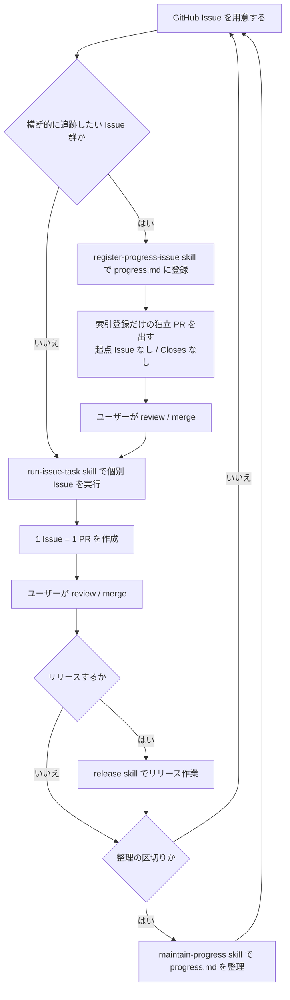

# 開発ループ入口

この文書は、slapex で作業を始めるときに読む入口である。人間と AI agent が同じ流れを共有し、GitHub Issue / `progress.md` / skill / PR / release の役割を混ぜないために使う。

詳細な手順は各 guideline と skill を正本とし、この文書には全体の流れと参照先だけを置く。

## 基本方針

- 作業は必ず GitHub Issue から始める。例外は、個別 Issue の実装に対応しない運用作業に限る。`progress.md` の索引登録(`register-progress-issue`)、進捗整理(`maintain-progress`)、リリース(`release`。リリース準備 PR と、その後の検証記録 PR の両方を含む)がこれにあたり、いずれも起点 Issue を作らず、PR に `Closes` を付けない。索引登録でいえば「Issue を索引に登録するための Issue」は指示書として意味を持たないためである。例外はこの 3 種に限り、実装作業へ広げない。
- 複数 Issue をまとめて 1 ブランチで進めない。実行時は `doc/guidelines/issue-driven-task-execution.md` に従い、1 Issue = 1 ブランチ = 1 PR とする。
- 横断的に見渡したい Issue 群は、任意だが推奨の準備として `progress.md` の進行中タスク索引に登録する。
- PR の merge は agent が行わない。レビューと merge 判断はユーザーが行う。
- リリースや進捗整理は、個別 Issue の実装とは分けて扱う。

## 標準フロー

## 各資材の役割

| 資材 | 役割 |
|---|---|
| GitHub Issue | 作業の入力。背景、依存、作業内容、スコープ外、検証を置く。 |
| `progress.md` | リリース台帳と進行中タスクの索引。詳細経緯やブランチ作業ログは置かない。 |
| Pull Request | 1 Issue に対する変更単位。description には変更意図、検証、未検証事項、`Closes #<Issue>` を書く。起点 Issue を持たない運用作業(索引登録・進捗整理・リリース)の PR には `Closes` を付けない。索引登録の PR には、登録した Issue の一覧と順序・依存の根拠を description に書く。 |
| `working-branch-notes/` | ブランチ単位の作業目的、状況、判断、引き継ぎメモ。PR に含めるが最終仕様書ではない。 |
| decision log | 後から辿る必要がある設計判断や方針変更の記録。進捗管理や作業ログは置かない。 |
| guideline | 人間と AI agent が共通で従う恒久的な作業ルール。 |
| skill | 特定の作業を始めるための実行手順。詳細手順は各 skill の `SKILL.md` を正本とする。 |

## 使う skill

| タイミング | skill | 使いどころ |
|---|---|---|
| 既存 Issue 群を索引化したいとき | `register-progress-issue` | GitHub Issue を読み、依存・順序・ブロッカーを整理して `progress.md` に最小限の行を追加または更新する。 |
| 個別 Issue に着手するとき | `run-issue-task` | Issue 番号を入力に、依存確認、ブランチ作成、note 作成、実装、検証、PR 作成までを進める。 |
| 新しいバージョンを公開するとき | `release` | リリース PR、tag、GitHub Release、配布物検証を安全に進める。merge と tag push の最終実行はユーザーが行う。 |
| リリース前後や Issue 群完了後 | `maintain-progress` | `progress.md` を薄く保ち、完了済みタスクを要約し、リリース台帳と進行中タスク索引を最新化する。 |

## 参照順

1. 作業したい内容に対応する GitHub Issue を読む。
2. 横断的に追跡する必要があれば、`register-progress-issue` skill で `progress.md` に登録する。索引登録は起点 Issue を作らず、索引登録だけの独立 PR として出す。
3. 個別作業は `run-issue-task` skill で開始する。
4. 実装中に方針決定が必要になった場合は、`doc/guidelines/decision-log-guidelines.md` に従う。
5. PR 作成時は `doc/guidelines/pull-request-guidelines.md` に従う。
6. merge 後、リリースする場合は `release` skill を使う。
7. 区切りで `maintain-progress` skill を使い、`progress.md` を整理する。

## 重複させない情報

- Issue 本文や skill の詳細手順を `progress.md` に複製しない。
- `issue-driven-task-execution.md` の手順をこの文書に全文複製しない。
- release の詳細手順をこの文書に置かない。
- working branch note を恒久仕様として扱わない。
- decision log を進捗表や作業メモとして使わない。
