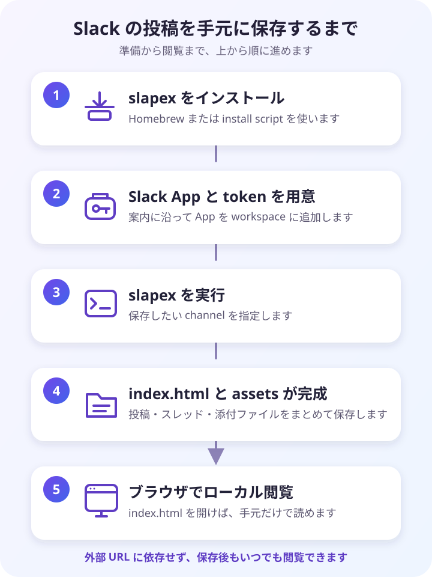

# クイックスタート

このページは、`slapex` を初めて使う人が、インストールから初回 export・閲覧までを 1 ページで完走するためのチェックリストです。上から順に進めてください。所要時間の目安は合計 15 分程度です。

各ステップに所要時間の目安と「完了の確認」を付けています。詳細手順はこのページに複製せず、各ステップから正本の help へリンクします。

先に成果物の見た目を確かめたい場合は、README の [出力プレビュー](../../README.md#出力プレビュー) を見てください。

全体の流れ:



## 前提(1 分)

- [ ] macOS または Linux(amd64 / arm64)を使っています(Windows は初期対象外)。
- [ ] 取得対象の Slack workspace のメンバーで、Slack App を作成できます(workspace の権限設定によっては管理者承認が必要になる場合があります)。
- [ ] bot token を使う予定がある場合のみ: 対象 channel へ bot / app を `/invite` できます(private channel ではその channel の参加者が実行します)。

まずは自分の参照できる channel を保存する用途なら、user token(`xoxp-`)だけで完走できます。CI やチーム共有の運用は、後から [bot token の手順](slack-app-setup.md#bot-token-を使う場合) で追加できます。

## 1. インストールする(2 分)

macOS(Homebrew):

```sh
brew install --cask kiyohara/tap/slapex
```

macOS / Linux 共通(install script。checksum 検証込みで `/usr/local/bin` に配置):

```sh
curl -fsSL https://raw.githubusercontent.com/kiyohara/slapex/main/scripts/install.sh | sh
```

1 ステップずつ確認したい場合やインストール先を変えたい場合は、[インストール](installation.md) にある手動手順・オプションを使ってください。

完了の確認:

- [ ] `slapex --version` がバージョンを表示します。

```text
$ slapex --version
slapex 1.1.2
```

## 任意: token なしで試す(1 分)

Slack App や token を用意する前に、同梱の架空サンプルから手元で export を生成して、成果物を実際に確かめられます(実 Slack への通信はありません)。

```sh
slapex --demo --output ./slapex-demo
```

実行の最後に、出力先ディレクトリ(この例では `./slapex-demo/<workspace-label>/<channel-label>/`)の絶対 path が 1 行表示されます。そのディレクトリの `index.html` をブラウザで開くと、手順 4 と同じ形の成果物を確認できます。このステップを飛ばしても完走には影響しません。

## 2. Slack App を作成して token を発行する(10 分)

手順の正本は [Slack App 準備手順](slack-app-setup.md) です。流れは次の 3 つで、manifest を貼り付ければ scope 設定はまとめて済みます。

1. [manifest から App を作成します](slack-app-setup.md#推奨手順-user-token-用-app-を-manifest-から作成する)。
2. App を workspace に install します。
3. `OAuth & Permissions` に表示される `User OAuth Token` をコピーします。

完了の確認:

- [ ] `xoxp-`(user token)で始まる token を取得しました(bot token の場合は `xoxb-`)。
- [ ] token をコピーしました。手順 3 では token 入力プロンプトに貼り付けて使います(追加ツールは不要です)。継続利用では secret manager(1Password など)や CI secrets への保存を推奨します([Token の渡し方](token-injection.md))。
- [ ] bot token の場合のみ: 対象 channel で `/invite @slapex` を実行して [bot / app を channel に参加させました](slack-app-setup.md#bot--app-を-channel-に参加させる)。

## 3. 初回 export を実行する(1 分)

操作可能なターミナルで実行します。`<channel-keyword>` は channel 名・channel ID・名前の一部のどれでも構いません。

```sh
slapex <channel-keyword>
```

- `SLACK_TOKEN` が未設定の場合、token の対話入力プロンプトが表示されます。入力は画面に表示(echo)されず、どこにも保存されません。手順 2 でコピーした token を貼り付けてください。
- `<channel-keyword>` を省略すると、候補一覧から channel を対話選択できます。
- 継続利用では、secret manager や CI secrets から実行時に注入する方法を推奨します(詳細は [Token の渡し方](token-injection.md))。

完了の確認:

- [ ] 進捗表示が次のような完了 summary で終わり、最後に出力先ディレクトリの絶対 path が 1 行表示されました(この path は stdout に出るため、script からも受け取れます)。

```text
✓ Done       Example Workspace (example.slack.com, T012345...) / #engineering (C012345..., public, active, member) (in 42s)
  messages: 345 (threads: 12, replies: 40)
  assets: 30 saved, 2 skipped by size limit, 0 failed
  output: /path/to/output/example-workspace/engineering
/path/to/output/example-workspace/engineering
```

## 4. 出力を閲覧する(1 分)

手順 3 で表示された出力先ディレクトリの `index.html` をブラウザで開きます。

```sh
# macOS の例(<output-path> は手順 3 で表示された path):
open "<output-path>/index.html"
```

Linux ではファイルマネージャから開くか、`xdg-open "<output-path>/index.html"` を使ってください。

完了の確認:

- [ ] 投稿・スレッド・画像・添付ファイルが、外部 URL に依存せずローカルだけで閲覧できます。

これで完走です。

## 次のステップ

- 取得日(`--date`)、任意期間(`--from` / `--to`)、相対期間(`--days`)、取得件数(`--max-posts`)、出力先(`--output`)などの調整: [使い方](usage.md#主要な-option) の option 一覧。
- 継続利用に向けて、token を毎回手入力せず secret manager(1Password CLI など)や CI secrets から注入する方法: [Token の渡し方](token-injection.md)。
- CI・定期実行・チーム共通 automation での利用: [bot token の手順](slack-app-setup.md#bot-token-を使う場合)。

## つまずいたら

典型的なつまずきと対処、および取得範囲や再現されない表示などの制限は [よくある質問・制限事項](faq.md) にまとめています。まず [うまくいかないとき](faq.md#うまくいかないとき) を確認してください。
