# Slack App Setup Help

このページは、`slapex` を使うために利用者自身が Slack App を作成し、Slack OAuth token を発行する手順をまとめます。

`slapex` は token を保存しません。発行した Slack OAuth token は実行時に渡します(基本は token 入力プロンプトへの貼り付け)。継続利用では secret manager または CI secrets への保存を推奨します([Token の渡し方](token-injection.md))。

## 前提

- 利用者自身が Slack App を作成します。
- App は取得対象の workspace に install します。
- Enterprise org-wide install は初期対象外です。
- デフォルトの利用方法は user token(`xoxp-`)です。
- CI、定期実行、チーム共通 automation、個人ユーザーに紐付けたくない運用では bot token(`xoxb-`)も正式サポートします。
- user token では、認可したユーザー本人が参照できる範囲の conversation が対象になります。
- bot token では、対応 scope に加えて bot / app が対象 conversation の member である必要があります。

このページのスクリーンショットは撮影時点の Slack UI であり、実際の画面と細部が異なる場合があります。その場合は本文の手順を正として読み替えてください。スクリーンショット内の workspace 名(`myworkspace`)はダミーで、token はマスク済みです。実際の画面では自分の workspace 名と token 実値が表示されます。

## アクセスするページ

Slack App の作成と設定では、次の Slack API pages を使います。

| 目的 | URL |
|---|---|
| Slack App を新規作成する | <https://api.slack.com/apps?new_app=1> |
| 作成済み Slack App を管理する | <https://api.slack.com/apps> |
| App manifest の公式説明 | <https://docs.slack.dev/tools/app-manifests/> |
| token types の公式説明 | <https://docs.slack.dev/authentication/tokens/> |
| OAuth install の公式説明 | <https://docs.slack.dev/authentication/installing-with-oauth/> |

## どちらの token を使うか

| token type | 主な用途 | channel アクセス要件 |
|---|---|---|
| user token(`xoxp-`) | 個人が自分の参照できる Slack channel 履歴を手元に保存する | 認可したユーザー本人が見える範囲に従う |
| bot token(`xoxb-`) | CI、定期実行、チーム共通 automation | 対応 scope に加えて bot / app が対象 channel に参加している必要がある |

まずは user token を使います。CI やチーム共有の実行では bot token を使います。

## 推奨手順: user token 用 App を manifest から作成する

Slack App は、個別に scope を追加するだけでなく、manifest を貼り付けて必要設定をまとめて作成できます。

### 1. App を新規作成する

1. <https://api.slack.com/apps?new_app=1> を開きます。
2. `Create an app` ダイアログで `From a manifest` をクリックします。

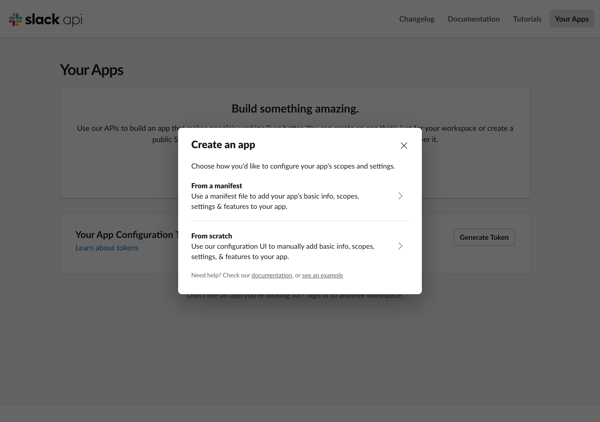

3. workspace 選択画面で取得対象の workspace を選び、`Next` をクリックします。

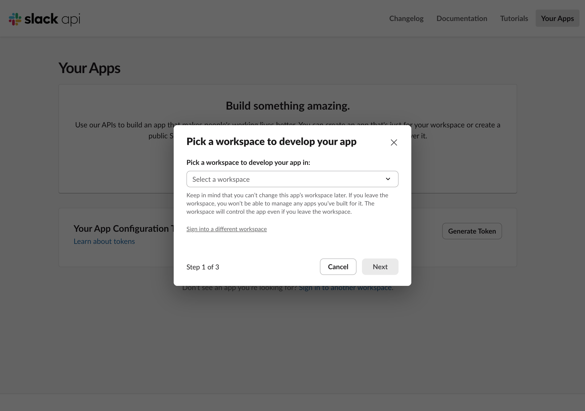

### 2. manifest を貼り付ける

1. manifest editor 上部の tab が `JSON` になっていることを確認します。
2. editor の内容をすべて消し、下の「Manifest の例」を貼り付けて `Next` をクリックします。

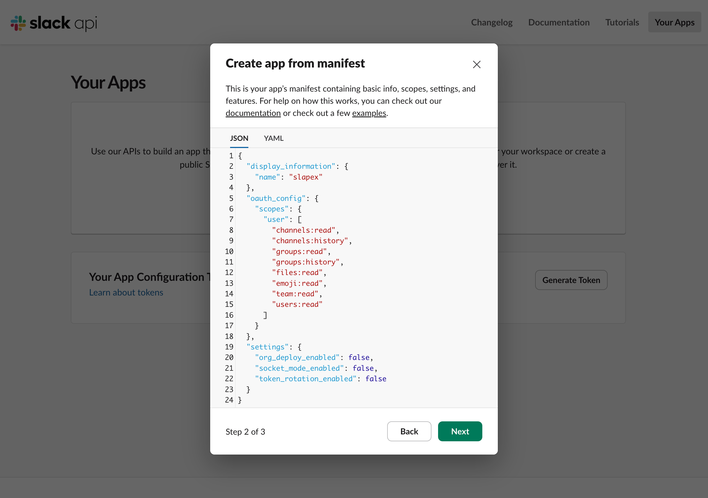

3. Review summary に `User Scopes` の一覧が表示されます。内容を確認して `Create` をクリックすると App が作成されます。

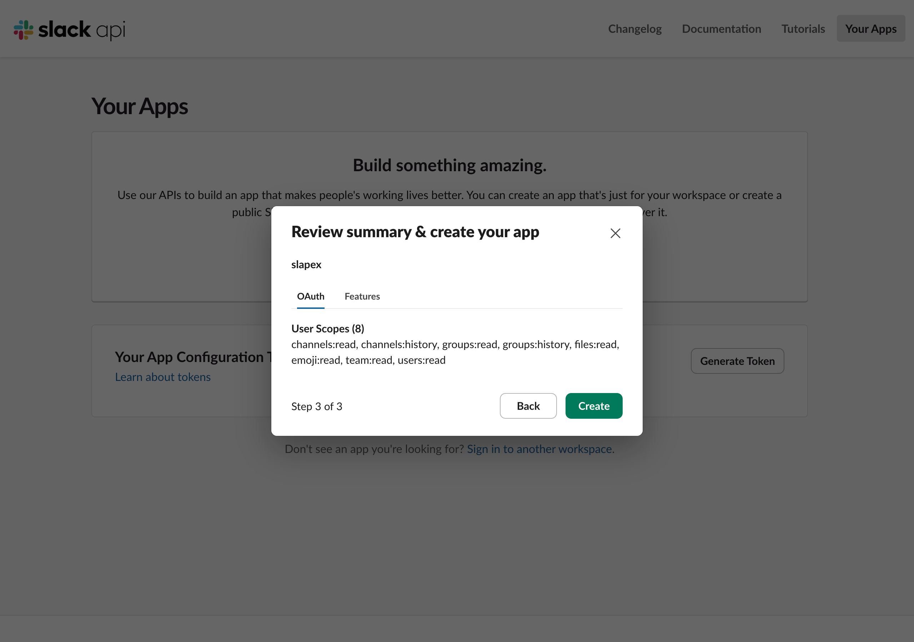

### 3. App を workspace に install する

1. App 管理画面の左メニューから `OAuth & Permissions` を開きます。
2. ページ上部の `OAuth Tokens` にある `Install to <workspace 名>` ボタンをクリックします。同じ操作は左メニューの `Install App` からも行えます。


3. 認可画面で要求される権限を確認し、`Allow` をクリックします。権限設定によって承認 request が表示される場合は、workspace 管理者の承認を待ちます。

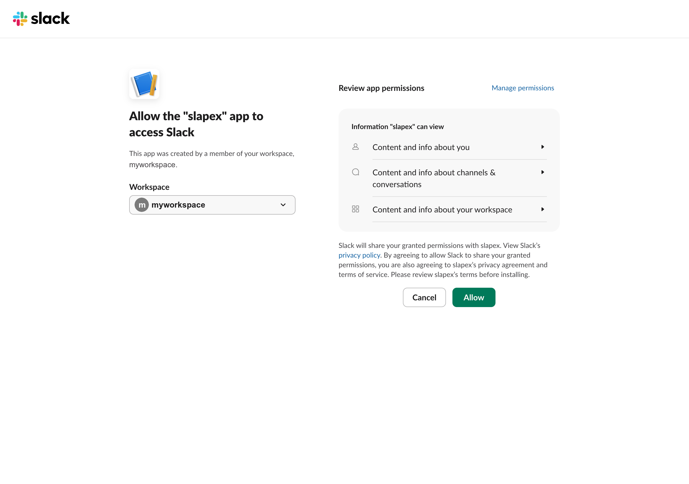

### 4. User OAuth Token を取得する

1. install / authorize 後、`OAuth & Permissions` の `OAuth Tokens` に `User OAuth Token` が表示されます。token は通常 `xoxp-` で始まります。
2. `Copy` をクリックして token をコピーします。


3. 取得した token をコピーします。初回実行では token 入力プロンプトに貼り付けて使えます。継続利用では secret manager または CI secrets に保存することを推奨します([Token の渡し方](token-injection.md))。token をファイルや chat に貼らないでください。
4. [Token の渡し方](token-injection.md) に従って実行時に渡します。

Manifest の例:

```json
{
  "display_information": {
    "name": "slapex"
  },
  "oauth_config": {
    "scopes": {
      "user": [
        "channels:read",
        "channels:history",
        "groups:read",
        "groups:history",
        "files:read",
        "emoji:read",
        "team:read",
        "users:read"
      ]
    }
  },
  "settings": {
    "org_deploy_enabled": false,
    "socket_mode_enabled": false,
    "token_rotation_enabled": false
  }
}
```

`display_information.name` は、workspace 上で分かりやすい名前に変更できます。

## bot token を使う場合

bot token は CI、定期実行、チーム共通 automation、個人ユーザーに紐付けたくない運用で使います。

user token の場合と共通なのは App 新規作成と workspace 選択の画面のみで、その先は bot token 用の manifest と画面で進めます。

1. 「推奨手順」の「1. App を新規作成する」と同じ手順で、App の新規作成を開始して取得対象の workspace を選びます。
2. manifest editor の tab が `JSON` になっていることを確認し、下の「Manifest の例」を貼り付けて `Next` をクリックします。

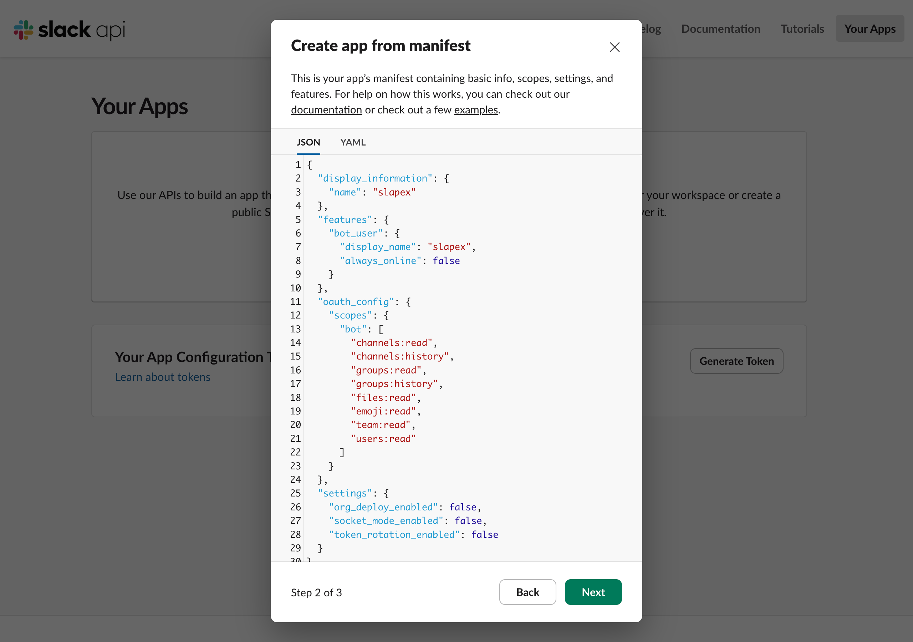

3. Review summary に `Bot Scopes` の一覧が表示されます。内容を確認して `Create` をクリックすると App が作成されます。

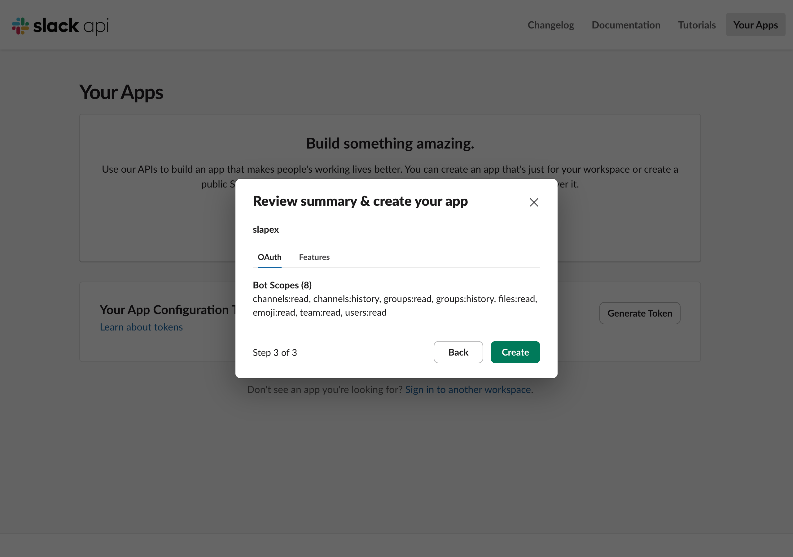

4. 左メニューの `OAuth & Permissions` を開き、`OAuth Tokens` にある `Install to <workspace 名>` ボタンをクリックします。

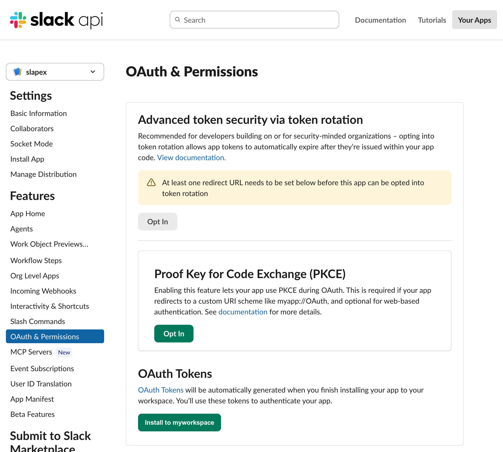

5. 認可画面で要求される権限を確認し、`Allow` をクリックします。権限設定によって承認 request が表示される場合は、workspace 管理者の承認を待ちます。

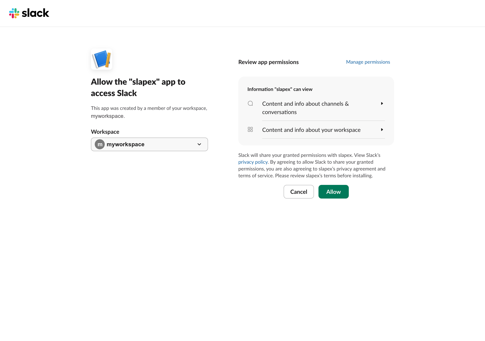

6. install / authorize 後、`OAuth & Permissions` の `OAuth Tokens` に表示される `Bot User OAuth Token` を取得します。token は通常 `xoxb-` で始まります。

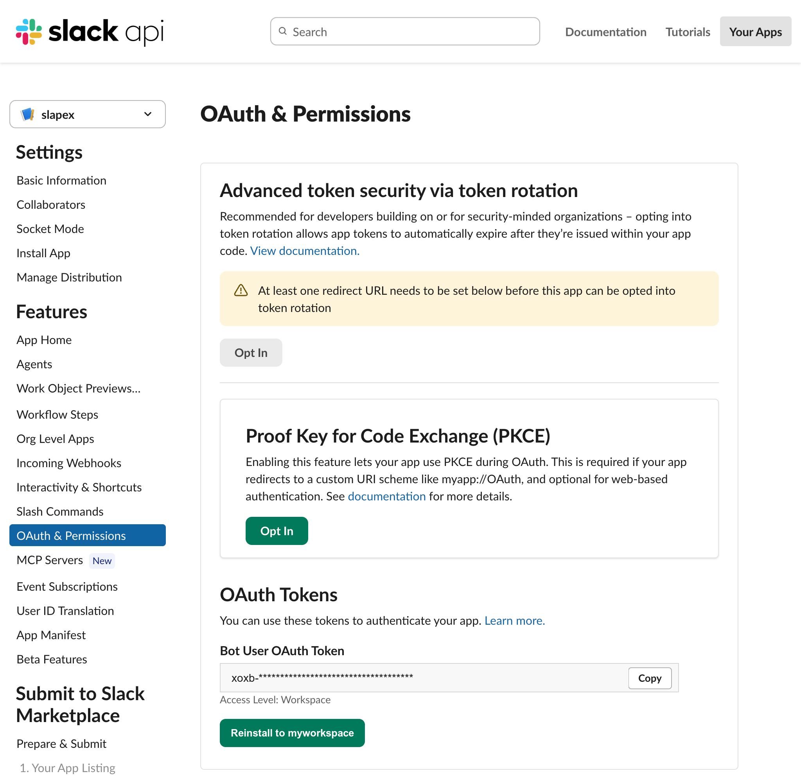

7. bot / app を取得対象 channel に参加させます(手順は「bot / app を channel に参加させる」を参照)。
8. bot token をコピーします。初回実行では token 入力プロンプトに貼り付けて使えます。継続利用では secret manager または CI secrets に保存することを推奨します([Token の渡し方](token-injection.md))。
9. [Token の渡し方](token-injection.md) に従って実行時に渡します。

Manifest の例:

```json
{
  "display_information": {
    "name": "slapex"
  },
  "features": {
    "bot_user": {
      "display_name": "slapex",
      "always_online": false
    }
  },
  "oauth_config": {
    "scopes": {
      "bot": [
        "channels:read",
        "channels:history",
        "groups:read",
        "groups:history",
        "files:read",
        "emoji:read",
        "team:read",
        "users:read"
      ]
    }
  },
  "settings": {
    "org_deploy_enabled": false,
    "socket_mode_enabled": false,
    "token_rotation_enabled": false
  }
}
```

`display_information.name` と `features.bot_user.display_name` は、workspace 上で分かりやすい名前に変更できます。

## 手動設定する場合

manifest を使わずに設定する場合は、次の手順で作成します。

1. <https://api.slack.com/apps?new_app=1> を開き、Slack API の App 管理画面で App を作成します。
2. App を取得対象の workspace に紐付けます。
3. user token を使う場合は、App の OAuth & Permissions で User Token Scopes を設定します。
4. bot token を使う場合は、App の OAuth & Permissions で Bot Token Scopes を設定し、必要に応じて bot user を有効化します。
5. App を workspace に install / authorize します。権限設定によって承認 request が表示される場合は、workspace 管理者の承認を待ちます。
6. user token では `User OAuth Token`、bot token では `Bot User OAuth Token` を取得します。
7. bot token を使う場合は、bot / app を取得対象 channel に参加させます(手順は「bot / app を channel に参加させる」を参照)。
8. 取得した token をコピーします。初回実行では token 入力プロンプトに貼り付けて使えます。継続利用では secret manager または CI secrets に保存することを推奨します([Token の渡し方](token-injection.md))。
9. [Token の渡し方](token-injection.md) に従って実行時に渡します。

## Scopes

public channel と private channel の両方を扱えるように、user token / bot token のどちらでも次の scope を設定します。manifest を使う場合、user token では `oauth_config.scopes.user`、bot token では `oauth_config.scopes.bot` に記載済みです。

| 目的 | scope |
|---|---|
| public channel の一覧・解決 | `channels:read` |
| public channel の投稿取得 | `channels:history` |
| private channel の一覧・解決 | `groups:read` |
| private channel の投稿取得 | `groups:history` |
| スレッド返信の取得 | 対象 conversation 種別に対応する `*:history` |
| 画像・添付ファイルの情報取得と download | `files:read` |
| カスタム絵文字の一覧取得 | `emoji:read` |
| workspace icon の取得(任意。無い場合は icon なしで出力) | `team:read` |
| 投稿者名や表示名の解決 | `users:read` |

### scope 変更後の再 install

scope を追加または変更すると、`OAuth & Permissions` の画面上部に再 install を促す banner が表示されます。banner 内の `reinstall your app` リンク(または `OAuth Tokens` の `Reinstall to <workspace 名>` ボタン)から App を workspace に再 install / 再 authorize します。

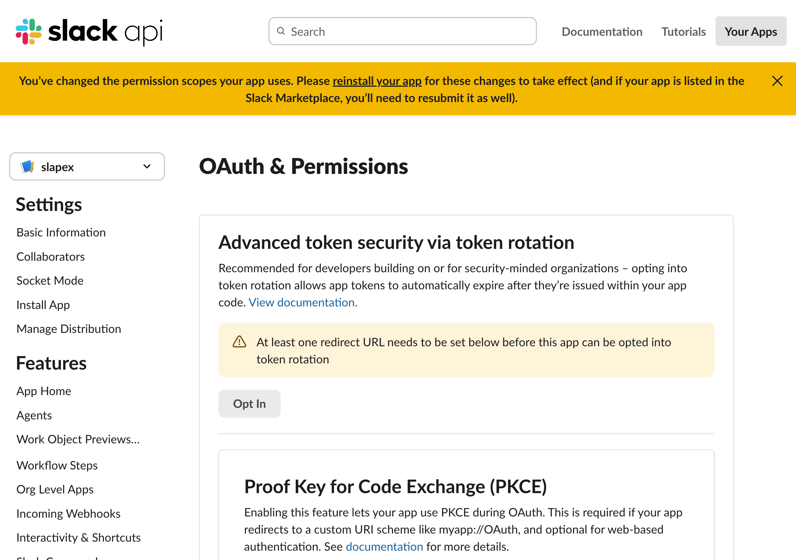

再 install / 再 authorize すると token が更新される場合があります。`OAuth & Permissions` に表示されている現在の token を、利用中の方法に反映します([Token の渡し方](token-injection.md) の「token を更新したとき」)。

## bot / app を channel に参加させる

bot token で channel の投稿を取得するには、scope に加えて bot / app が対象 channel の member である必要があります。

public channel / private channel のどちらも、対象 channel のメッセージ入力欄で `/invite @<App 名>` を実行して追加します。この help の manifest どおりに作成した場合は `/invite @slapex` になります。

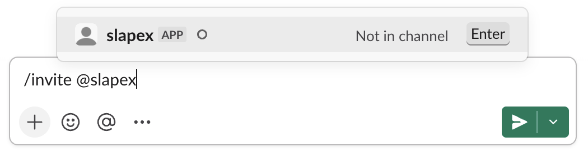

private channel は参加 member 以外には見えないため、その private channel に参加している member が `/invite` を実行します。

次の方法でも同じ結果になります。

- メッセージ入力欄に `@<App 名>` をメンションとして投稿し、表示される案内から channel に追加します。
- channel 名をクリックして設定を開き、`Integrations` tab の `Add apps` から App を追加します。

user token を使う場合、この操作は不要です(認可したユーザー本人が参照できる範囲が対象になります)。

## Channel access

user token を使う場合、認可したユーザー本人が参照できる範囲がアクセス範囲になります。対象 channel が見えない場合は、そのユーザーが対象 channel を参照できるか、必要 scope が付いているかを確認します。

bot token を使う場合、public channel / private channel の投稿を取得するには、対応する scope だけでは不十分です。取得対象 channel に bot / app が参加している必要があります。参加していない場合は「bot / app を channel に参加させる」の手順で追加します。

## Token の渡し方

ローカルの `.env` や shell history に token の実値を残さないでください。

追加ツールなしで実行する場合は、`SLACK_TOKEN` を設定せずに `slapex` を実行し、表示される token 入力プロンプトへコピーした token を貼り付けます。

```sh
slapex engineering
# SLACK_TOKEN is not set.
# Paste a Slack OAuth token to use for this run only.
# It is kept in memory only: not echoed, and not written to files, cache, logs or HTML.
# For repeated use, provide it from a secret manager (e.g. 1Password CLI) or CI secrets.
# Enter SLACK_TOKEN (input hidden):
```

入力は画面に表示(echo)されず、貼り付けた token はその 1 回の実行の中だけで使われます。設定ファイル・cache・log・HTML 出力には保存されず、コマンド行に書かないため shell history にも残りません。

継続利用では、1Password CLI などの secret manager から実行時に注入する方法を推奨します。

```sh
SLACK_TOKEN="op://<vault>/<item>/<field>" \
  op run -- slapex engineering
```

CI では secret store から `SLACK_TOKEN` を job に渡します。CI / automation では bot token を `SLACK_TOKEN` に入れる運用を基本候補とします。

```yaml
steps:
  - name: Export Slack posts
    env:
      SLACK_TOKEN: ${{ secrets.SLACK_TOKEN }}
    run: |
      slapex engineering --output ./exports
```

実行時の貼り付け、shell 環境変数への一時設定、1Password CLI、CI secrets など、用途別の詳しい手順は [`token-injection.md`](token-injection.md) を参照してください。

## よくあるエラー

### `SLACK_TOKEN` が未設定

操作可能な端末では、`SLACK_TOKEN` を設定せずに実行すると token 入力プロンプトが表示されます。コピーした token を貼り付けてください。CI や `--no-interactive` など prompt が使えない環境では、環境変数として渡す必要があります([Token の渡し方](token-injection.md))。

### token が無効

取得した token が正しいか確認します。secret manager や CI secrets に保存している場合は、保存値も確認してください。App を uninstall した場合や scope を変更した場合は、再 install / 再 authorize して token を更新します。

### scope が不足している

OAuth & Permissions で不足 scope を追加し、App を workspace に再 install / 再 authorize します(手順は「scope 変更後の再 install」を参照)。更新後の token を利用中の方法に反映します([Token の渡し方](token-injection.md) の「token を更新したとき」)。

### channel が見えない

channel 名または channel ID を確認します。user token の場合は、認可したユーザーが対象 channel を参照できるか確認します。bot token の場合は、bot / app がその channel に参加しているか確認します。

### bot token 利用時に bot が channel に参加していない

「bot / app を channel に参加させる」の手順に従い、対象 channel に bot / app を追加します。

## 参考

- Slack Developer Docs: [Creating apps with manifests](https://docs.slack.dev/tools/app-manifests/)
- Slack Developer Docs: [Installing with OAuth](https://docs.slack.dev/authentication/installing-with-oauth/)
- Slack Developer Docs: [Tokens](https://docs.slack.dev/authentication/tokens/)
- Slack Developer Docs: [`auth.test`](https://docs.slack.dev/reference/methods/auth.test/)
- Slack Developer Docs: [`conversations.history`](https://docs.slack.dev/reference/methods/conversations.history/)
- Slack Developer Docs: [`conversations.replies`](https://docs.slack.dev/reference/methods/conversations.replies/)
- Slack Developer Docs: [`conversations.list`](https://docs.slack.dev/reference/methods/conversations.list/)
