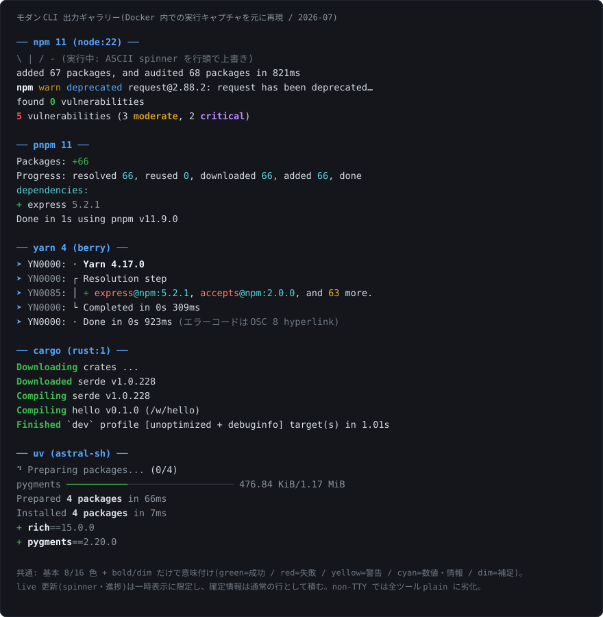
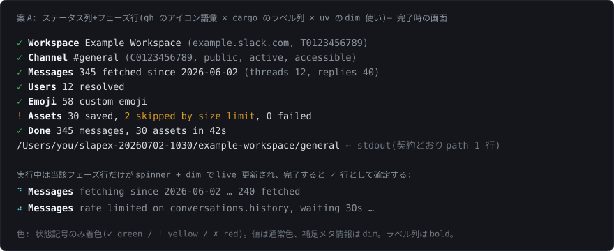
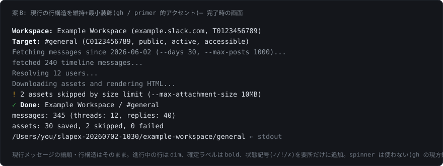
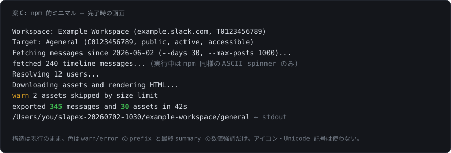
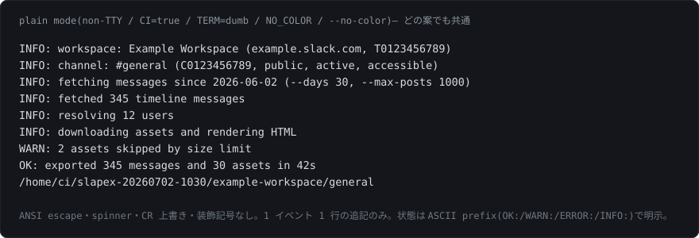

# 調査レポート: モダン CLI ツールの出力 UX(Issue #100 補助 note)

- ブランチ: `post-v1/cli-output-ux`
- 主 note: `draft_post-v1-cli-output-ux.md`
- 最終更新: 2026-07-02

Issue #100 の「モダンなターミナル表示」を具体化するため、代表的なモダン CLI ツールの出力表現を調査し、slapex への適用案を整理したレポート。画像は `assets/cli-output-ux/` 配下の SVG(キャプチャした実出力を元に手作業で再現したモック)を参照する。

## 1. 調査の方法

- **実観察**: Docker コンテナ内で各ツールを TTY あり(`docker run -t`)/ なし(pipe)の両方で実行し、ANSI escape sequence を含む生出力をキャプチャして解析した。
  - npm 11(`node:22-alpine`)、pnpm 11、yarn 4(berry)、cargo(`rust:1-slim`)、uv(`astral-sh/uv`)
- **一次資料**:
  - GitHub CLI デザインガイドライン(primer/cli リポジトリ、アーカイブ済みだが gh の設計原則の正本): https://github.com/primer/cli
  - GitHub Blog「Building a more accessible GitHub CLI」(2025): https://github.blog/engineering/user-experience/building-a-more-accessible-github-cli/
  - Command Line Interface Guidelines: https://clig.dev/
  - NO_COLOR 標準: https://no-color.org/ (調査時 DNS 不達のため仕様文言は既知内容+clig.dev の言及に基づく。実装時に原文を再確認する)
  - `charmbracelet/colorprofile`(既に slapex の transitive 依存)の検出実装

## 2. 横断的な発見: モダン CLI の共通文法



調査した全ツールに共通するパターン。これが「モダンな見栄え」の実体と言える。

1. **色は基本 8/16 色(4-bit)+ bold / dim だけ**。意味付けはほぼ業界共通: green=成功・追加、red=失敗、yellow=警告・保留、cyan=数値・情報、gray/dim=補足・メタ情報。gh は 256 色から 4-bit へ意図的に「戻した」(利用者のターミナルテーマ設定を尊重し、背景色とのコントラスト問題を利用者側で解決可能にするため)。
2. **色は意味の強化にだけ使い、意味の伝達には使わない**(primer: "Only use color to enhance meaning, not to communicate meaning")。色を剥がしても文面だけで読める。
3. **アイコンは Unicode 記号の最小セット**。gh の語彙: `✓`(成功)、`-`(中立)、`✗`(失敗)、`+`(変更要求)、`!`(警告)。絵文字は主要ツールの通常出力では使われない(フォントの Unicode 対応差と「toy-like」になる懸念。clig.dev も過剰使用を戒める)。
4. **spinner は 2 系統**: braille ドット `⠋⠙⠹…`(uv、JS 系の ora ライブラリ)と ASCII `\|/-`(npm)。gh は 2025 年のアクセシビリティ改善で spinner を廃止し、静的テキスト("Working..." 等)へ移行した(スクリーンリーダーが再描画を追えないため)。
5. **live 更新領域は一時表示、確定情報は行として積む**。pnpm / uv は進捗カウンタやバーをカーソル制御で上書きし、フェーズ完了時には確定行だけを残す。ログとして残るのは確定行のみ。
6. **完了 summary は簡潔な 1 行+必要な詳細行**。npm「added 67 packages, and audited 68 packages in 821ms」、pnpm「Done in 1s using pnpm v11.9.0」、cargo「Finished \`dev\` profile ... in 1.01s」、uv「Installed 4 packages in 7ms」。所要時間を含めるのが通例。
7. **non-TTY では全ツールが plain に自動劣化**。カーソル制御・spinner は消え、色も消える。劣化後もフォーマットが崩れない(npm: 進捗を全部省略 / pnpm: カウンタを行単位で追記 / uv: フェーズ単位 1 行)。
8. **標準の色制御規約を尊重**: `NO_COLOR`(設定され空でなければ色を止める)、`TERM=dumb`(non-TTY 扱い)、`--no-color`。`CLICOLOR=0` / `CLICOLOR_FORCE` も準標準(bixense 提唱)。`CI` 変数を見るかはツール次第だが、Issue #100 は plain 化条件に含める方針(妥当)。

## 3. ツール別の観察結果

### npm 11 — ミニマル路線

```
(TTY)  \ | / -  ← 行頭 CR + 行クリアで回る ASCII spinner
added 67 packages, and audited 68 packages in 821ms
npm warn deprecated request@2.88.2: request has been deprecated, ...
     ^bold ^yellow ^bright-blue
found 0 vulnerabilities          ← 0 が bold green
5 vulnerabilities (3 moderate, 2 critical)
^red bold          ^yellow bold  ^magenta bold
```

- 装飾は驚くほど少ない。進捗の詳細は出さず、spinner 1 個と結果 summary だけ。
- 色は「結果の良し悪し」の強調に集中(脆弱性 0 = green、あり = red / 深刻度別色)。
- warning は `npm`(bold)+ `warn`(yellow)+ カテゴリ(bright blue)の 3 トークン prefix。
- pipe 実行では spinner・ANSI が完全に消え、summary 行だけになる(キャプチャで確認)。

### pnpm 11 — カウンタ進捗

```
Packages: +66                    ← +66 green
Progress: resolved 66, reused 0, downloaded 66, added 66, done   ← 数値 cyan
dependencies:                    ← cyan
+ express 5.2.1                  ← + green, version gray
Done in 1s using pnpm v11.9.0
```

- 複数行の live 領域(Packages / Progress)をカーソル上移動(`ESC[nA`)+消去(`ESC[0J`)で更新。
- 数値を cyan で強調する「カウンタ進捗」が特徴。処理量が多いツール向き。
- pipe 実行ではカウンタが行追記になり、`+++++...` のバーが 1 行出る(確認済み)。

### yarn 4 (berry) — 構造化ステップログ

```
➤ YN0000: · Yarn 4.17.0
➤ YN0000: ┌ Resolution step
➤ YN0085: │ + express@npm:5.2.1, ..., and 63 more.
➤ YN0000: └ Completed in 0s 309ms
```

- 全行に `➤`(bright blue)+ ログコード(`YN0000` は gray)。コードは OSC 8 hyperlink でドキュメントへリンクされる。
- ステップを罫線(`┌ │ └`)でグルーピング。構造は美しいが、全行 prefix はログ密度が高く「CI ログ寄り」の見た目。
- slapex 規模のツールには過剰と判断。

### cargo — 右寄せ verb 列(静かな進行)

```
 Downloading crates ...
  Downloaded serde v1.0.228
   Compiling serde v1.0.228
   Compiling hello v0.1.0 (/w/hello)
    Finished `dev` profile [unoptimized + debuginfo] target(s) in 1.01s
```

- 12 桁に右寄せした動詞だけを bold + bright green で着色し、残りは無色。ANSI は `ESC[1m ESC[92m` のみで極めてシンプル(キャプチャ確認)。
- 「今どのフェーズにいるか」が縦に揃った列で一目で分かる。フェーズ進行型ツールの古典にして完成形。

### uv — braille spinner + dim 主体(最新トレンド)

```
⠙ Preparing packages... (0/4)        ← spinner white、テキスト dim
pygments   ██████──────  476.84 KiB/1.17 MiB   ← バー green、残り dim
Prepared 4 packages in 66ms          ← dim、数値部分だけ bold
Installed 4 packages in 7ms
 + rich==15.0.0                      ← + green、名前 bold、version dim
```

- 基調を dim にして、確定した成果(パッケージ名、件数)だけを通常色 / bold で浮かせる「引き算」の配色。
- braille spinner + 複数進捗バーの live 領域は完了後に消え、`Prepared/Installed` の確定行だけが残る。
- pipe 実行では `Resolved/Prepared/Installed` のフェーズ行 1 行ずつに劣化(確認済み)。

### gh (GitHub CLI) — デザインガイドラインの明文化

primer/cli(gh のデザイン正本)から、slapex に直接使える規則:

- 色の意味: Red=Error/closed/failing、Green=Success/open、Yellow=Warning/pending、Bright Black(Gray)=Draft/secondary text、Cyan=Branches、Magenta=Merged。
- 記号: `✓` Success / `-` Neutral / `✗` Failure / `!` Alert / `+` Changes requested。「成功に ✓、失敗に ✗ を使い分け、削除の成功にも(警告でなく)✓ を使う」。
- タイポグラフィ: 同一サイズ・同一フォント前提。階層は bold と空白・インデント・改行で作る。イタリックは使わない。
- 機械出力(pipe)では: 色・スタイルなし、状態は色でなく明示テキスト、列はタブ区切り、truncate しない、ヘッダなし。
- アクセシビリティ(2025 blog): spinner を braille 再描画から静的テキスト進捗(文脈メッセージ+ "Working…")へ置換。パレットを 4-bit へ整列。プロンプトは `charmbracelet/huh` へ移行(slapex が channel 選択に使っているものと同じ)。

## 4. 色制御の標準・規約まとめ

| 規約 | 意味 | slapex での扱い(Issue #100 案) |
|---|---|---|
| stderr が TTY か | 装飾判定の基本。出力先 stream 自身で判定する | 判定基準に採用(stderr 基準) |
| `NO_COLOR` | 設定され空でなければ色を止める(事実上の標準) | plain 化条件に採用 |
| `TERM=dumb` | エスケープ非対応端末。non-TTY 相当 | plain 化条件に採用 |
| `CI=true` | 主要 CI が設定するデファクト。明示標準はない | plain 化条件に採用 |
| `--no-color` | ツール固有 flag。clig.dev 推奨 | 正式 option 化(色だけでなく装飾全部を抑止) |
| `CLICOLOR` / `CLICOLOR_FORCE` | bixense 提唱の準標準。FORCE は pipe でも色を強制 | 初期実装では対象外でよい(colorprofile 採用時は自動で乗る) |

実装面の補足: `charmbracelet/colorprofile`(huh の transitive 依存として既に go.sum にある)は `NO_COLOR` / `CLICOLOR` / `CLICOLOR_FORCE` / `TERM=dumb` / `COLORTERM` を処理するが、**`CI` は見ない**。`CI=true` → plain は slapex 自前の判定が必要。

## 5. slapex への適用検討

### slapex の出力はフェーズ進行型

slapex の 1 回の実行は「workspace 確定 → channel 解決 → 履歴取得 → thread 取得 → user 解決 → emoji 取得 → assets/render → summary」と直列に進む。package manager 型(多数の項目を並列処理し件数カウンタが主役)より、**cargo / uv / gh のフェーズ語彙**が構造に合う。

現状の出力(全行無装飾)は情報としては揃っており、装飾の載せ方だけが論点になる。現状の行構造は `doc/design/usage-flow.md`「処理対象の表示」の仕様(workspace / channel label の表示タイミング)を満たしている。

### 見栄え 3 案

| | 案 A: ステータス列+フェーズ行 | 案 B: 現行構造+最小装飾 | 案 C: npm 的ミニマル |
|---|---|---|---|
| モデル | gh の記号 × cargo のラベル列 × uv の dim | gh / primer(spinner なし) | npm |
| 行構造 | フェーズごとに 1 行へ再構成 | 現行のまま | 現行のまま |
| 記号 | `✓ ! ✗` + braille spinner | `✓ ! ✗` のみ | なし(`warn` 等のテキスト prefix) |
| 色 | 記号+ラベル bold+メタ dim | 記号+ラベル bold+進行中 dim | warn/error と summary 数値のみ |
| live 更新 | 進行中フェーズ行を上書き | なし(行追記のみ) | spinner のみ |
| 実装コスト | 中(行上書き管理が必要) | 小 | 最小 |
| 設計文書への影響 | usage-flow の表示例を書き換え | 最小 | 最小 |







どの案でも plain mode は共通(Issue #100 の方針どおり):



### 推奨

**案 A を推奨**する。理由:

- slapex の実行はフェーズ直列で、フェーズ 1 行モデルが情報構造と一致する。「今どこで待っているか」(特に Slack rate limit 待ち)が spinner 行として自然に表せる。
- 調査した中で「モダン」の代表格(uv、cargo)と gh の記号語彙を組み合わせており、Issue #100 の目的(カラーリング・アイコン・アニメーションインジケーターの活用)を最も素直に満たす。
- 色は記号と dim に限定する「引き算」配色なので、4-bit のみでテーマ非依存・低リスク。

ただし live 上書きの実装コストと、gh が spinner を廃止した方向性(アクセシビリティ)も事実として重い。**案 B は「gh の現在地」に最も近い安全案**であり、コスト・アクセシビリティ重視ならこちら。案 C は「何もしないよりまし」の最小案で、Issue の目的からはやや物足りない。

### spinner の選択肢(案 A 採用時)

| | braille `⠋⠙⠹…` | ASCII `\|/-` | なし(静的 `...`) |
|---|---|---|---|
| 採用例 | uv、ora(JS 系標準) | npm | gh(2025〜) |
| 見た目 | 最もモダン | レトロ・確実 | 地味だが確実 |
| フォント依存 | あり(braille 未対応フォントで崩れ) | なし | なし |
| アクセシビリティ | 再描画頻度次第 | 同左 | 最良 |

braille は macOS / Linux の主要ターミナルではまず崩れない。TTY 限定の装飾であり、plain mode では出ないため、リスクは限定的。

### 実装オプション(依存ポリシー 0033 との整合)

| 方式 | 依存への影響 | 概要 |
|---|---|---|
| (1) 自前 ANSI helper | なし(stdlib のみ) | SGR コード(8 色 + bold/dim)を小さな UI helper に閉じ込める。4-bit しか使わないため十分小さい |
| (2) lipgloss v2 直接利用 | go.mod 昇格のみ(新規 module 追加ゼロ。huh の transitive 依存として取得済み) | スタイル定義が宣言的になるが、この規模には過剰気味 |
| (3) colorprofile writer 併用 | 同上(取得済み) | NO_COLOR / CLICOLOR / TERM 判定を委譲できる。ただし CI 判定は自前 |

必要な装飾は「8 色 + bold/dim + 行上書き(CR + EL)」だけなので、**(1) 自前 helper で十分**というのが調査後の見立て(cargo が実際にこの水準)。判定ロジック(TTY / CI / NO_COLOR / TERM=dumb / --no-color)も数行で書ける。依存を増やさないので decision log 0033 の変更も不要(採用条件を変えないため。note: (2)(3) を選ぶ場合は 0033 追記が必要)。

## 6. 未決事項(ユーザー確認予定)

1. 全体の見栄え: 案 A / B / C のどれにするか。
2. (案 A の場合)spinner 文字: braille / ASCII / 静的テキスト。
3. 色の濃さ: 記号のみ着色(推奨モックの水準)か、数値・ラベルへの着色も足すか。

→ 確認結果は主 note の「決定事項」に記録する。
